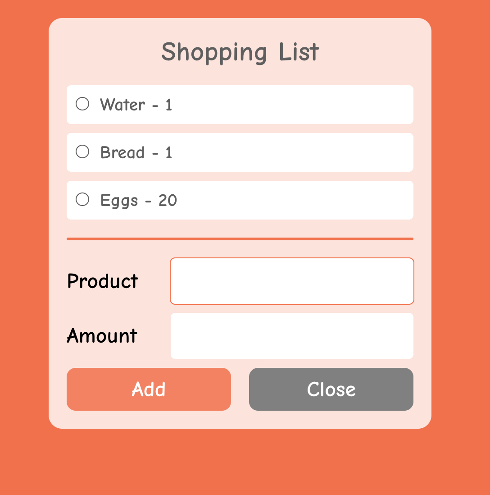

# 🛒 Shopping List App (Frontend)

A simple React application that helps users manage their shopping list.  
Currently, this repository contains **only the frontend** part of the project.  
The plan is to extend it later with a backend (Node.js + Express + MongoDB) to make it a fullstack application.

---

## 💡 Features

- ➕ Add products with name and amount
- ✅ Mark products as bought (checkbox → item gets crossed out)
- ⏳ Auto-delete checked items after a delay
- 🗑 Instantly delete products with a button
- ✏️ Automatically update product amount if the same item is added again
- 🔔 Temporary messages for feedback (adding, updating, deleting)
- 🎨 Minimalist design with form toggle and divider

---

## 🔧 Tech Stack

- React + Hooks (`useState`, `useEffect`, `useRef`)
- Axios (for API communication)
- Vite (for fast development and build)
- CSS (modular styling)
- Services layer for API requests

---

## 📁 Project Structure

<pre>
<code>
📁 src/
├── App.jsx
├── App.css
├── components/
│   ├── Button.jsx
│   ├── Divider.jsx
│   ├── Form.jsx
│   ├── List.jsx
│   └── Message.jsx
└── services/
    └── products.js
</code>
</pre>

---

## 🚀 Getting Started

1. **Clone the repository**

```bash
git clone https://github.com/ant-tur/shopping-list-frontend.git
cd shopping-list-frontend
```

2. **Install dependencies**

```bash
npm install
```

3. **Run mock backend with JSON Server**

```bash
npm run server
```

4. **Start the development server**

```bash
npm run dev
```

---

## 🔗 Live Demo

👉 (Coming soon in full project)

---

## 🖼️ Screenshot



---

## 🛠️ Possible Improvements

- [ ] Connect to a backend (Node + Express + MongoDB)
- [ ] Add user authentication (personal shopping lists)
- [ ] Categories and filtering system
- [ ] Responsive design improvements
- [ ] Add unit tests

---

## 📜 License

MIT License — free to use, modify, and distribute.
